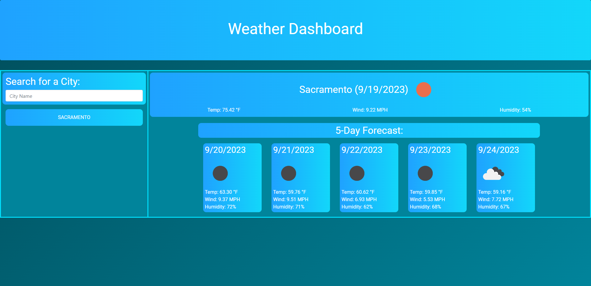

# Weather Forecaster

## Description

This project was created to see the current weather and the next 5 days of any city so you can plan accordantly. It will save your searches so you can quickly switch between different cities. I was motivated to make this project to be able to handle using server-side APIs and the information they provide. 

## Installation

N/A

## Usage

Visit the website https://nicolasflamel.github.io/weather-forecaster/ to see the working project. On your first load the site will grab the weather information for Sacramento, CA. You'll see same-day weather information and under will show the next 5 days weather forecast. On the left you can search with a city name by typing it in and pressing 'enter'. After the weather information is received it will replace and populate the weather informatoin on the left and add a button under the search which you can click to load in saved weather information from your searches. 

## Credits

N/A

## License

N/A